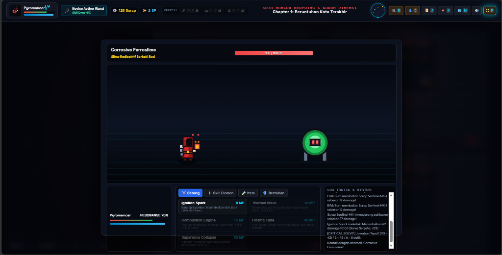
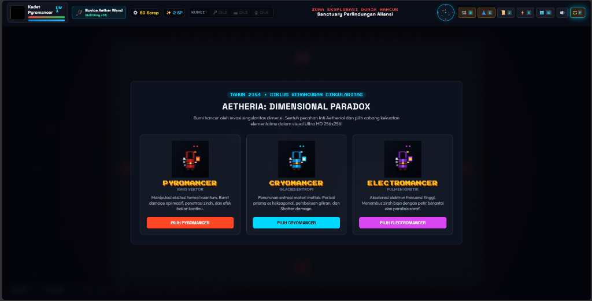

# 🌌 Aetheria: Dimensional Paradox

> **Story RPG Eksplorasi HD-2D** dengan kontrol WASD, Visual Pixel HD 256x256, Toko Senjata Tongkat Sihir & Ramuan, Lemari Kosmetik Kostum, Boss di setiap Chapter, dan Cerita Dunia yang Hancur.

---

## 🎮 Mainkan Sekarang
🔗 **Live Demo (GitHub Pages):** [https://mikael-sud.github.io/aetheria-game/](https://mikael-sud.github.io/aetheria-game/)

---

## 📸 Tangkapan Layar (Screenshots)

### ⚔️ Arena Pertarungan Taktis (Tactical Combat Arena)

### 🧙‍♂️ Pemilihan Kelas Elemental Karakter (Class Selection)

---

## 🕹️ Kontrol Permainan
- **W, A, S, D** : Bergerak (Atas, Kiri, Bawah, Kanan)
- **E / Spasi** : Interaksi dengan NPC, Toko, dan Portal Dimensi
- **F** : Layar Penuh (Fullscreen Mode)
- **B** : Buka Toko Senjata & Ramuan
- **C** : Buka Lemari Kosmetik & Skin Jubah
- **J** : Buka Jurnal Misi & Quest Log
- **K** : Buka Pohon Keahlian (Skill Tree)
- **M** : Buka Peta Cepat Dunia (World Map)

---

## ✨ Fitur Utama
1. **Visual HD-2D Retro Modern**: Efek partikel bercahaya dinamis, pencahayaan radial pahlawan, transisi cuaca debu & abu pijar, dan animasi fluid.
2. **Sistem Toko & Upgrade**:
   - Toko Senjata (Staff, Wand, Orb) dengan bonus atribut damage skill khusus.
   - Toko Potion & Buff consumables.
   - Lemari Kosmetik (Skin jubah & Headgear karakter).
3. **Boss Fight & Death-Riddle System**: Tumbangkan boss berkekuatan tinggi di tiap zona dimensional dan pecahkan teka-teki paradoks kuantum.
4. **Musik Latar Prosedural Dinamis (Web Audio BGM)**: Suara synthesizer retro futuristik yang berubah dinamis di setiap zona.
5. **Auto-Save & LocalStorage**: Progress level, koin scrap, item, dan kunci chapter tersimpan otomatis di browser.

---

## 🛠️ Teknologi
- **HTML5 & Vanilla CSS3**
- **JavaScript (Canvas 2D Engine)**
- **Web Audio API**

---

*Dikembangkan oleh Mikael Tarigan (Mikael-SUD)*
